# Michał Muzyka 2.3 – Sprawozdanie Lab 8

### Uruchamiam klaster z węzłem głównym i 3 węzłami roboczymi z pluginem CNI i sterownikiem Docker. Dla każdego węzła przydzielana jest pamięć RAM 1900 MB i 2 CPU.

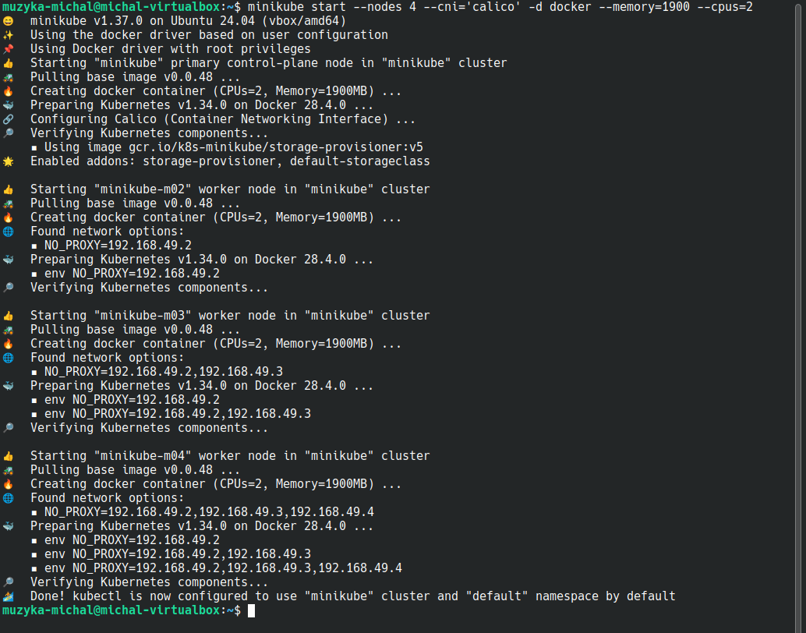

### Wyświetlam utworzone węzły. Oznaczam węzły etykietami kolejno A, B i C.

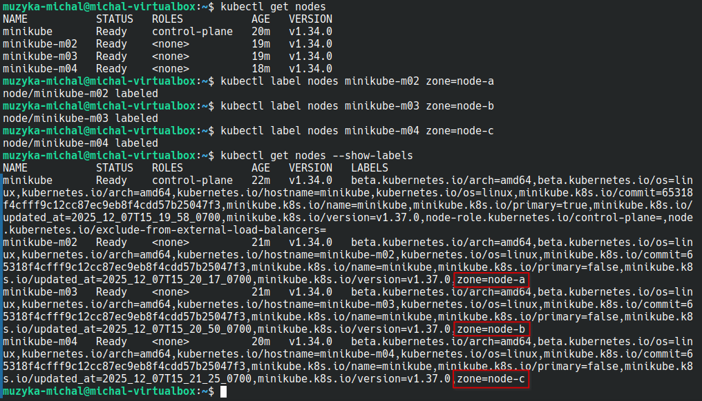

### Generuję plik Deploymentu o nazwie frontend na bazie obrazu nginx i 3 replikami. Dodaję do pliku sekcję nodeSelector z etykietą zone=node-a , aby pody tego Deploymentu znalazły się na węźle A.

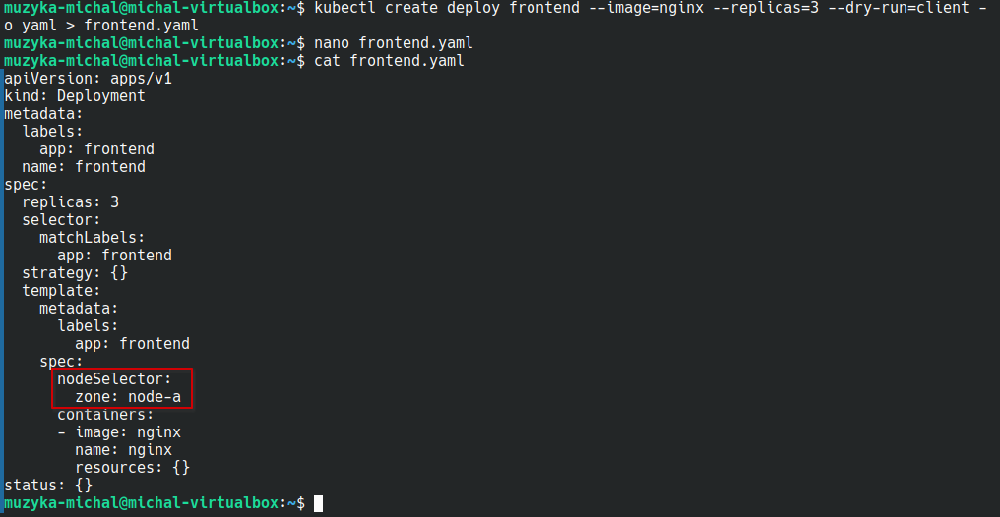

###  Generuję plik Deploymentu o nazwie backend na bazie obrazu nginx i 1 repliką. Dodaję do pliku sekcję nodeSelector z etykietą zone=node-b , aby pod tego Deploymentu znalazł się na węźle B.

### Generuję plik poda o nazwie my-sql na bazie obrazu mysql w wersji 5.7, ze zmienną środowiskową MYSQL_ROOT_PASSWORD=root z hasłem do bazy danych oraz etykietą app=my-sql, która przyda się później.

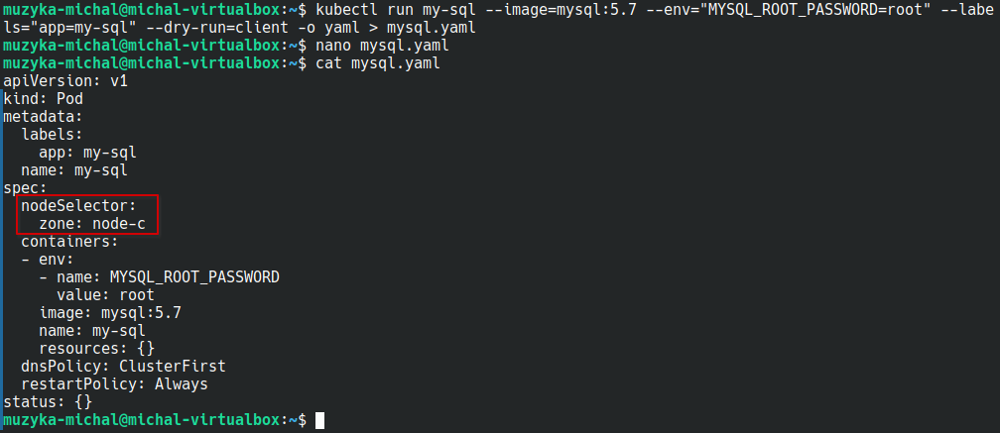

### Tworzę obiekty i weryfikuję ich działanie. Deploymenty i pody działają. Pody znajdują się na odpowiednich węzłach.

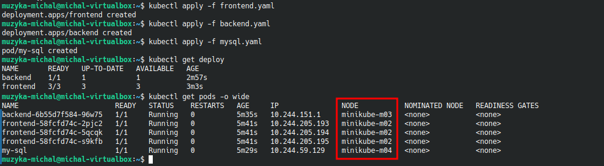

### Generuję plik obiektu Service typu NodePort dla Deploymentu frontend z portem usługi 80, target portem 80 i zewnętrznym portem NodePort równym 30080. Tworzę obiekt Service.

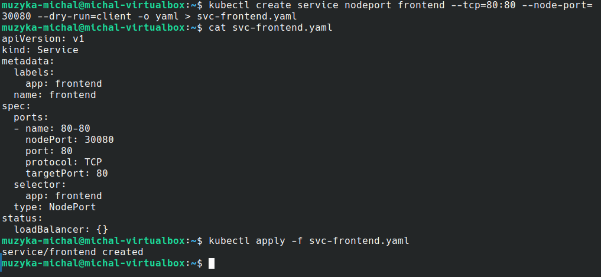

### Generuję plik obiektu Service typu ClusterIP dla Deploymentu backend z portem usługi 80 i target portem 80.

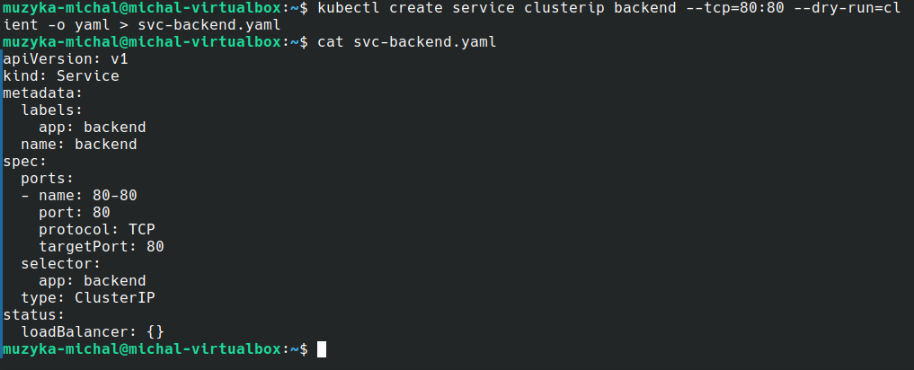

### Generuję plik obiektu Service typu ClusterIP dla poda my-sql z portem usługi 3306 i target portem 3306.

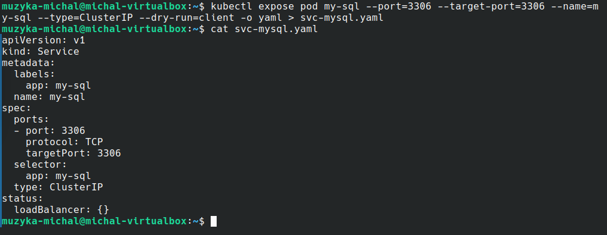

### Tworzę obiekty Service dla Deploymentu backend i poda my-sql. Sprawdzam poprawność.

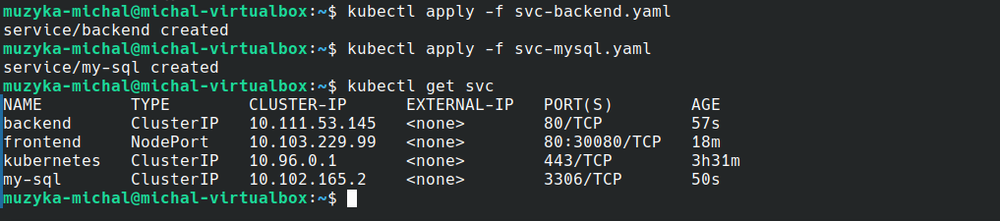

### Tworzę plik obiektu NetworkPolicy. W nim ustawiam, że polityka sieciowa odnosi się do poda my-sql o ustawionej wcześniej etykiecie app=my-sql. Ustawiam kontrolowany typ ruchu - wejściowy Ingress, gdzie pody tylko z etykietą app=backend, czyli backend, mogą łączyć się z ustalonym wcześniej podem, ale tylko na porcie 3306 przez TCP. Każdy inny ruch (w tym od app=frontend) zostanie automatycznie odrzucony przez plugin CNI Calico.

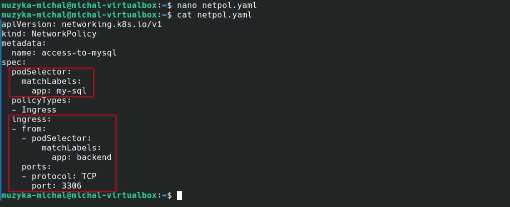

### Tworzę obiekt NetworkPolicy i weryfikuję czy został utworzony.
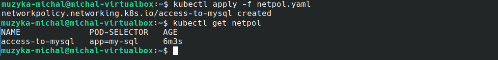

### Testuję poprawność utworzonej polityki. Sprawdzam adres usługi my-sql. Sprawdzam nazwy podów backendu i frontendu. Uruchmiam polecenie curl na wybranych podach frontendu i backendu. Udało nazwiązać połączenie z my-sql tylko przez pod backendu.

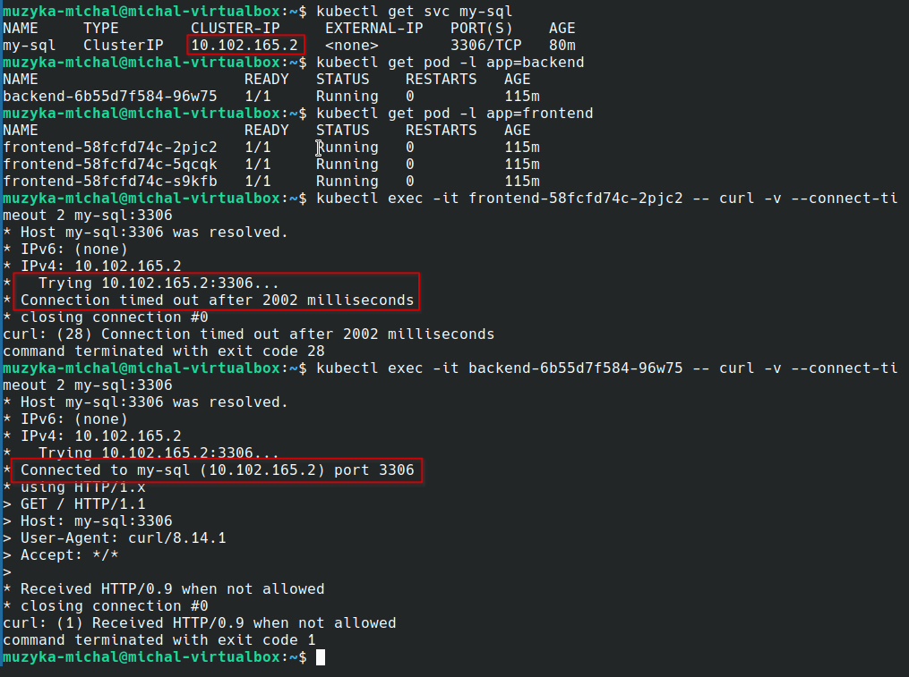

### Dodatkowo testuję poprawność utworzonej polityki przez utworzenie tymczasowych podów busybox - jeden bez etykiety, drugi z inną etykietą, a trzeci z etykietą app=backend. Tylko trzeci zdołał się połączyć z my-sql. Polityka sieciowa działa poprawnie.

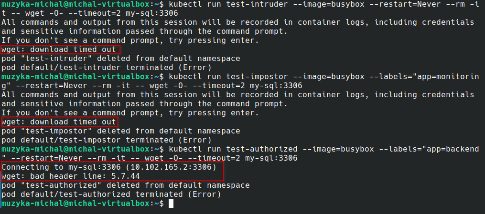
